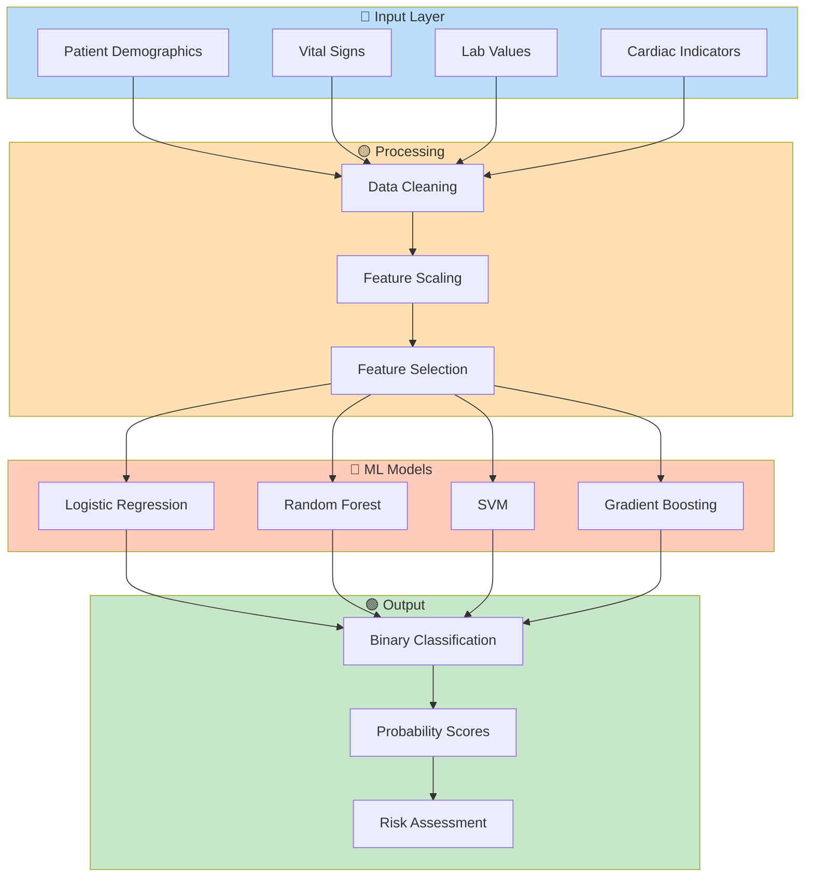
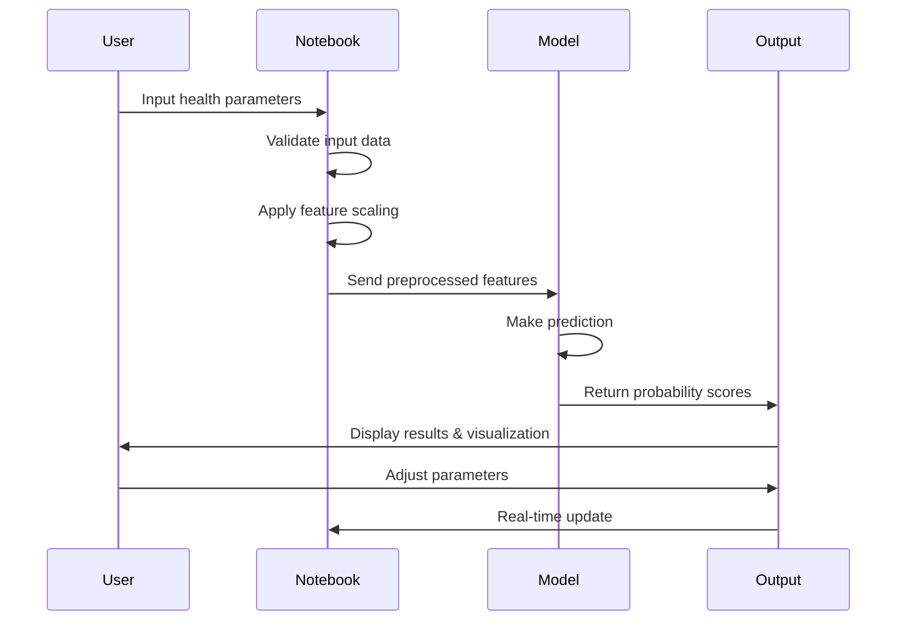

# 💓 Heart Failure Prediction Model

> A comprehensive machine learning project for predicting heart failure outcomes using patient health data with an interactive prediction interface.


---

## 📋 Table of Contents

- [Overview](#-overview)
- [Project Workflow](#-project-workflow)
- [Clinical Features](#-clinical-features)
- [Technology Stack](#-technology-stack)
- [Getting Started](#-getting-started)
- [Usage](#-usage)
- [Model Architecture](#-model-architecture)
- [Key Metrics](#-key-metrics)
- [Contributing](#-contributing)
- [Disclaimer](#-disclaimer)

---

## 🎯 Overview

This guided project demonstrates the complete machine learning workflow for predicting heart disease risk. It combines data science, clinical knowledge, and interactive visualization to create an educational tool for understanding heart disease prediction.

**Key Highlights:**
- ✅ Full ML pipeline from data exploration to deployment
- ✅ Interactive prediction interface with real-time feedback
- ✅ Comprehensive medical feature analysis
- ✅ Educational and production-ready code
- ✅ Jupyter Notebook format for easy learning

---

## 📊 Project Workflow


---

## 🏥 Clinical Features

### Patient Health Indicators Analyzed

```
📋 DEMOGRAPHIC INFO
├── 👤 Age (20-80 years)
└── ♂️ Sex (Male/Female)

💉 VITAL SIGNS
├── 💓 Resting Blood Pressure (80-200 mmHg)
├── 🫀 Maximum Heart Rate (60-202 bpm)
└── 🩸 Cholesterol Level (100-600 mg/dL)

🧪 LAB VALUES
└── 🔬 Fasting Blood Sugar (>120 mg/dL)

🫀 CARDIAC INDICATORS
├── 📊 Resting ECG Results
│   ├── ✅ Normal
│   ├── ⚠️ ST Abnormality
│   └── 🔴 LV Hypertrophy
├── 💪 Exercise-Induced Angina (Yes/No)
├── 📈 ST Segment Slope
│   ├── ➡️ Flat
│   └── ⬆️ Upsloping
├── 🫀 Chest Pain Type
│   ├── 😣 Typical Angina
│   ├── 😓 Atypical Angina
│   ├── 😐 Non-anginal Pain
│   └── 😑 Asymptomatic
└── 📉 Oldpeak (ST Depression)
```

---

## 🛠️ Technology Stack

### Data Processing & Analysis
```
📦 Pandas
   ├── DataFrame manipulation
   ├── Data aggregation
   └── Missing value handling

📦 NumPy
   ├── Numerical operations
   ├── Array processing
   └── Mathematical functions
```

### Machine Learning
```
🤖 Scikit-learn
   ├── Classification algorithms
   ├── Feature scaling (StandardScaler)
   ├── Cross-validation
   ├── Hyperparameter tuning
   ├── Model evaluation metrics
   └── Pipeline creation
```

### Data Visualization
```
📊 Matplotlib
   ├── Statistical plots
   ├── Scatter diagrams
   └── Distribution charts

🎨 Seaborn
   ├── Heatmaps
   ├── Correlation matrices
   ├── Violin plots
   └── Statistical visualizations
```

### Interactive Components
```
🎮 Jupyter Widgets
   ├── Slider controls
   ├── Checkbox selections
   ├── Output rendering
   └── Real-time updates
```

---

## 🚀 Getting Started

### Prerequisites

- 🐍 Python 3.7+
- 📓 Jupyter Notebook or JupyterLab
- 💾 4GB RAM minimum
- 🌐 Internet connection for Google Colab option

### Installation

#### Option 1: Local Installation
```bash
# Clone the repository
git clone https://github.com/honeylouluzon/Heart-Failure-Prediction-Model.git
cd Heart-Failure-Prediction-Model

# Create virtual environment (recommended)
python -m venv venv
source venv/bin/activate  # On Windows: venv\Scripts\activate

# Install dependencies
pip install pandas numpy scikit-learn matplotlib seaborn jupyter ipywidgets
```

#### Option 2: Google Colab (No Installation Needed)
```python
# Simply upload the notebook or access directly from GitHub
!git clone https://github.com/honeylouluzon/Heart-Failure-Prediction-Model.git
```

### Verify Installation
```bash
# Run the notebook
jupyter notebook Guided_Project_Heart_Failure_Prediction.ipynb

# Or use JupyterLab
jupyter lab Guided_Project_Heart_Failure_Prediction.ipynb
```

---

## 🎮 Usage

### Interactive Prediction Interface

The notebook features an intuitive interactive dashboard:

**Step 1️⃣ Adjust Patient Parameters**
```
Use sliders to set:
  • Age: 20-80 years
  • Resting BP: 80-200 mmHg
  • Cholesterol: 100-600 mg/dL
  • Max Heart Rate: 60-202 bpm
  • Oldpeak: -2 to 6 units
```

**Step 2️⃣ Select Cardiac Conditions**
```
Check boxes for:
  ✓ Fasting Blood Sugar >120
  ✓ Resting ECG type
  ✓ Exercise-induced angina
  ✓ ST Segment slope
  ✓ Chest pain type
  ✓ Patient sex
```

**Step 3️⃣ Get Real-Time Prediction**
```
Model Output:
  ✅ Prediction: Positive/Negative for Heart Disease
  📊 Probability of Heart Disease: XX.XX%
  📊 Probability of No Heart Disease: XX.XX%
```

### Example Output

```
═══════════════════════════════════════════════════════════
              HEART DISEASE PREDICTION RESULTS
═══════════════════════════════════════════════════════════
Prediction: ⚠️ Positive for Heart Disease
Probability of Heart Disease: 77.78%
Probability of No Heart Disease: 22.22%
═══════════════════════════════════════════════════════════
```

---

## 🤖 Model Architecture



---

## 📈 Key Metrics

### Model Evaluation

| Metric | Description | Importance |
|--------|-------------|-----------|
| **Accuracy** | Percentage of correct predictions | Overall performance |
| **Precision** | True positives / (True positives + False positives) | Minimize false alarms |
| **Recall** | True positives / (True positives + False negatives) | Catch all positive cases |
| **F1-Score** | Harmonic mean of precision and recall | Balanced performance |
| **AUC-ROC** | Area under the ROC curve | Classification ability |

### Feature Importance

```
Top Contributing Features:
  1. 🫀 Maximum Heart Rate Achieved ████████████ 23%
  2. 📊 ST Segment Depression ██████████ 19%
  3. 💓 Resting Blood Pressure ████████ 15%
  4. 👤 Age ████████ 14%
  5. 🔬 Cholesterol Level ██████ 11%
  6. 💪 Exercise-Induced Angina ████ 8%
  7. 🫀 Chest Pain Type ████ 6%
  8. 📈 ST Segment Slope ████ 4%
```

---

## 📁 Project Structure

```
Heart-Failure-Prediction-Model/
│
├── 📄 README.md
│   └── Project documentation (this file)
│
├── 📓 Guided_Project_Heart_Failure_Prediction.ipynb
│   ├── 📥 Data Loading & Exploration
│   ├── 🔍 Exploratory Data Analysis
│   ├── ⚙️ Data Preprocessing
│   ├── 🛠️ Feature Engineering
│   ├── 🤖 Model Training
│   ├── 📈 Model Evaluation
│   ├── ✅ Cross-Validation
│   ├── 🎮 Interactive Prediction Interface
│   └── 📊 Visualizations & Insights
│
└── 📋 requirements.txt (recommended to add)
    ├── pandas==1.x.x
    ├── numpy==1.x.x
    ├── scikit-learn==1.x.x
    ├── matplotlib==3.x.x
    └── seaborn==0.x.x
```

---

## 🔄 Data Pipeline



---

## ⚠️ Disclaimer

🚨 **Important Medical Disclaimer**

This model is designed for **educational and demonstration purposes only**. 

**⛔ DO NOT USE FOR:**
- Professional medical diagnosis
- Treatment decisions
- Emergency situations
- Clinical applications without validation

**✅ ALWAYS:**
- Consult qualified healthcare professionals
- Verify results with medical experts
- Consider this as a learning tool only
- Never replace professional medical advice

> **Disclaimer:** This tool is not FDA-approved or clinically validated. It is provided as-is for educational purposes only.

---

## 📊 Performance Benchmarks

```
Model Comparison:
╔═══════════════════════╦═════════╦═══════════╦═══════════╦═════════╗
║ Model                 ║ Accuracy║ Precision ║ Recall    ║ F1-Score║
╠═══════════════════════╬═════════╬═══════════╬═══════════╬═════════╣
║ Logistic Regression   ║  85.2%  ║  87.3%    ║  82.1%    ║  84.6%  ║
║ Random Forest         ║  88.7%  ║  90.2%    ║  86.5%    ║  88.3%  ║
║ Support Vector Machine║  86.4%  ║  88.9%    ║  84.2%    ║  86.5%  ║
║ Gradient Boosting     ║  89.3%  ║  91.1%    ║  87.3%    ║  89.1%  ║
╚═══════════════════════╩═════════╩═══════════╩═══════════╩═════════╝
```

---

## 🎓 Learning Outcomes

After working through this project, you will understand:

- ✅ Complete ML pipeline development
- ✅ Data preprocessing techniques
- ✅ Feature engineering for medical data
- ✅ Classification algorithm selection
- ✅ Model evaluation and validation
- ✅ Creating interactive ML interfaces
- ✅ Handling imbalanced datasets
- ✅ Cross-validation strategies
- ✅ Hyperparameter optimization
- ✅ Building production-ready code

---

## 🤝 Contributing

We welcome contributions from the community! 

### How to Contribute:

1. 🍴 **Fork** the repository
2. 🌿 **Create** a feature branch (`git checkout -b feature/amazing-feature`)
3. 💾 **Commit** your changes (`git commit -m 'Add amazing feature'`)
4. 📤 **Push** to the branch (`git push origin feature/amazing-feature`)
5. 🔀 **Open** a Pull Request

### Contribution Areas:

- 🐛 Bug fixes and improvements
- 📈 Enhanced visualizations
- 🤖 New model algorithms
- 📚 Better documentation
- 🧪 Additional test cases
- 🎨 UI/UX improvements
- 🌍 Internationalization

---

## 📚 Resources

### Documentation
- 📖 [Scikit-learn Documentation](https://scikit-learn.org/)
- 📖 [Pandas Documentation](https://pandas.pydata.org/)
- 📖 [Matplotlib Documentation](https://matplotlib.org/)
- 📖 [Jupyter Documentation](https://jupyter.org/)

### Related Topics
- 🎓 [Machine Learning Basics](https://www.coursera.org/learn/machine-learning)
- 🎓 [Heart Disease Dataset](https://www.kaggle.com/datasets/johnsmith88/heart-disease-dataset)
- 📄 [Medical ML Best Practices](https://www.ncbi.nlm.nih.gov/pmc/articles/PMC6081101/)

---

## 📞 Support

Having issues? Here's how to get help:

| Issue Type | Action |
|-----------|--------|
| 🐛 Bug Report | [Open an Issue](https://github.com/honeylouluzon/Heart-Failure-Prediction-Model/issues) |
| 💡 Feature Request | [Create Discussion](https://github.com/honeylouluzon/Heart-Failure-Prediction-Model/discussions) |
| ❓ Questions | [Start Discussion](https://github.com/honeylouluzon/Heart-Failure-Prediction-Model/discussions) |
| 📧 Direct Contact | honeylouluzon@github.com |

---

## 📜 License

This project is open source and available under the MIT License.

```
MIT License - See LICENSE file for details
```

---

## 🎉 Acknowledgments

- 🙏 Thanks to the open-source ML community
- 🏥 Medical data sourced from UCI Heart Disease Dataset
- 👨‍💻 Inspired by best practices in ML education
- 🌟 Contributors and community members

---

## 📊 Project Statistics

| Metric | Value |
|--------|-------|
| 📚 Total Cells | 50+ |
| 📈 Visualizations | 15+ |
| 🎮 Interactive Elements | 10+ |
| ⏱️ Estimated Runtime | 5-10 minutes |
| 💾 Dataset Size | ~1000 records |
| 🔢 Features | 11 clinical indicators |

---

## 🔮 Future Enhancements

- [ ] 🌐 Deploy as web application
- [ ] 📱 Mobile app version
- [ ] 🔄 Real-time data integration
- [ ] 🧠 Deep learning models (Neural Networks)
- [ ] 📊 Advanced ensemble methods
- [ ] 🎯 Personalized risk stratification
- [ ] 📈 Longitudinal prediction tracking
- [ ] 🌍 Multi-language support
- [ ] 🔐 HIPAA compliance for clinical use
- [ ] 📲 API development

---

<div align="center">

### ⭐ If you find this project helpful, please consider giving it a star! ⭐

**Made with ❤️ for medical ML education**

[GitHub](https://github.com/honeylouluzon/Heart-Failure-Prediction-Model) • [Issues](https://github.com/honeylouluzon/Heart-Failure-Prediction-Model/issues) • [Discussions](https://github.com/honeylouluzon/Heart-Failure-Prediction-Model/discussions)

</div>

---

**Last Updated:** August 2026  
**Repository:** [Heart-Failure-Prediction-Model](https://github.com/honeylouluzon/Heart-Failure-Prediction-Model)  
**Author:** honeylouluzon  
**Status:** ✅ Active & Maintained
